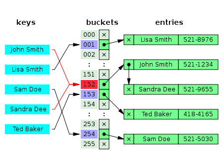
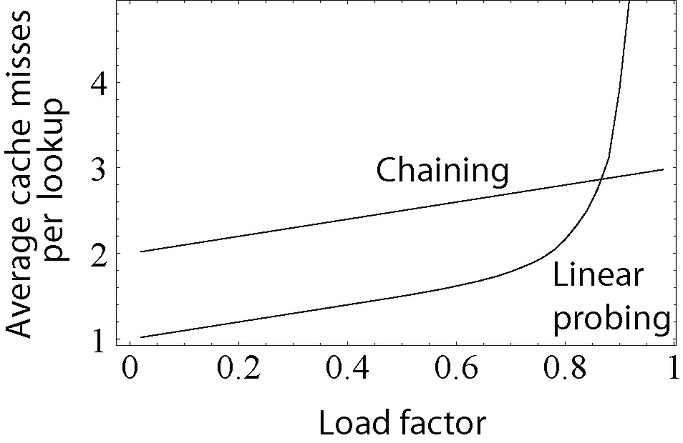

# [1주차] 해쉬 알고리즘 정리
***
## 🎯 목표
* 해시 알고리즘을 익히자.
***
## 해시 알고리즘
- 데이터를 다루는 기법 중 하나
- 임의의 크기를 가진 key를 고정된 크기의 value로 변환시켜 저장하는 것
- key에 대한 해시 값을 사용하여 값을 저장하고 key-value 쌍의 갯수에 따라 동적으로 크기가 증가하는 associate array
- 키에 대한 해시값을 구하는 과정을 hashing(해싱)이라고 하며 이때 사용하는 함수(알고리즘)을 해시함수라고 함
- 해시 값 자체를 index로 사용하기 때문에 평균 시간 복잡도가 O(1)로 매우 빠름
- 특정 데이터가 저장되는 인덱스는 그 데이터만의 고유한 위치이기 떄문에 삽입 시 다른 데이터의 사이에 끼어들거나 삭제 시 다른 데이터로 채울 필요가 없으므로 삽입과 삭제 시 데이터의 이동이 없도록 만들어진 구조
- 해시가 내부적으로 사용하는 배열을 Hash Table이라고 하며 그 크기에 따라서 성능 차이가 많이 날 수 있다.

## Hash Code
- 데이터의 효율적 관리를 목적으로 임의의 길이의 데이터를 입력받아 일정한 길이의 비트열로 반환시켜주는 함수
- 원래의 값이나 키는 색인에 사용되며, 그 값이 관련된 데이터가 검색될 때마다 다시 사용된다.
- 계산이 복잡하지 않고 키 값에 대해 중복 없이 해시 값을 고르게 만들어 내는 함수가 좋은 함수(충돌이 일어나지 않을수록 좋다.)
- 키들이 어떤 특정한(가시적인) 패턴을 가지더라도 해시함수 값이 불규칙적이 되도록 하는게 바람직하다.(해시 함수 값이 키의 특정 부분에 의해서만 결정되지 않도록 한다.)
- 문자열을 받아서 숫자를 반환하는 함수(함수는 문자열에 대해 숫자를 매핑)
- 대표적으로 나눗셈법(division method)과 곱셈법(multiplication method)이 있다.

## Hash Table
- 해시 함수를 사용하여 키를 해시값으로 매핑하고 이 해시값을 색인 혹은 주소 삼아 데이터의 값을 키와 함께 저장하는 자료구조
- bucket또는 slot : 데이터가 저장되는 곳
- 기본연산 : 삽입, 삭제, 탐색

### 장점
- 해시 테이블은 key-value가 1:1 매핑되어 있기 때문에 삽입, 삭제, 검색 과정에서 모듀 평균적으로 O(1)의 시간 복잡도를 가지고 있다.

### 단점
- 해시 충돌 발생
- 순서/관계가 있는 배열에 어울리지 않는다.(순서에 상관없이 key만을 가지고 삽입, 삭제, 검색하기 때문)
- 공간 효율성이 떨어짐(데이터가 저장되기 전에 미리 저장공간을 확보해야해서 공간이 부족하거나 아예 채워지지 않는 경우가 발생)
- hash function의 의존도가 높다.(평균 시간 복잡도가 O(1)이지만 해시함수가 매우 복잡하다면 해시 테이블의 연산 속도도 증가)

## Hash Collision (해시 충돌)
- 해시 충돌이란 서로 다른 데이터가 해싱을 거친 후 같은 키 값을 가지게 되는 경우다.
- 같은 키 값을 갖는 데이터가 생긴다는 것은, 특정 키의 bucket에 데이터가 집중된다는 뜻이고 너무 많은 해시 충돌은 해시 테이블의 성능을 떨어뜨린다.
- 실질적으로 해시충돌 발생 가능성을 고려한다면, 데이터 -> 키 값의 1대1 대응은 맞을 수 있으나, 키값 -> 데이터는 1대1 대응이 아니라고 봐야한다. 각 데이터는 무조건 하나의 키 값을 가지지만, 키 값 하나에는 여러개의 데이터가 만들어질 수 있다.
해시 함수를 통해 데이터를 키 값으로 암호화는 가능하나, 그 키값을 다시 해시함수로 역으로 복호화하는 과정은 불가능하다.
- 충돌에 의한 해결방법은 크게 두가지 방식이 있다. Chaining & open addressing(개방주소법)

## Chaining

- bucket내에 Linked List를 할당하여, bucket에 데이터를 삽입하다가 해시 충돌이 발생하면 Linked List로 데이터를 연결하는 방식
- 그림을 보면 Sandra Dee라는 사람의 연락처를 삽입할 때 충돌이 일어나니 bucket 내에서 Linked List로 데이터를 연결한다.

## Open Addressing 개방 주소법
- 체이닝의 경우 bucket이 꽉 차더라도 Linked List로 계속 늘려가기에, 데이터의 주소값은 바뀌지 않는다.(Closed Address)
- 개방주소법의 경우에는 해시 충돌이 일어나면 다른 bucket에 데이터를 삽입한다.
- 대표적으로 3가지가 있다.
- 선형탑색(Linear Probing) : 해시 충돌 시 다음 bucket, 혹은 몇 개를 건너뛰어 데이터를 삽입(순차 탐색)
- 제곱탐색(Quadratic Probing) : 해시 충돌 시 제곱만큼 건너뛴 bucketdp epdlxjfmf tkqdlq(1, 4, 9, 16..)
- 이중해시(Double Hashing) : 해시 충돌 시 다른 해시 함수를 한번 더 적용한 결과를 이용함. 다른 방법들 보다 많은 연산을 하게 됨

## Chainig과 OpenAddress의 비교

## Chaning의 장점
- LinkedList만 사용하면 된다. 즉 복잡한 계산식을 사용할 필요가 개방 주소법에 비해 적다.
- 해시 테이블이 채워질수록, LookUp 성능저하가 Linear하게 발생한다.

## Open Addressing의 장점
- 체이닝처럼 포인터가 필요없고, 지정한 메모리 외 추가적인 저장공간도 필요없다.
- 삽입, 삭제 시 오버헤드가 적다.
- 저장할 데이터가 적을 때 더 유리하다.

## 버킷 확장 (Resize)
- 해시 테이블 내에서 데이터를 저장할 수 있는 버킷을 늘려주는 것
- 우리가 생각하는 배열이나 객체처럼 무작정 데이터를 저장하는 자료구조의 크기가 늘어가는 것이 아니라 임의로 늘려줘야 한다.
- 해시 테이블을 만들 대 일정 버킷 수를 할당해준다. 따라서 데이터를 저장하다가 데이블 내의 버킷 수가 일정 임계점에 도달하면, 버킷 수를 늘려줘야한다.
- 일반적으로는 데이터가 들어있는 해시 버킷의 갯수가 75%가 되었을 때 버킷의 수를 두배로 늘려준다.

### Referenxe
https://velog.io/@xxhaileypark/Data-Structure-%ED%95%B4%EC%8B%9C-%EC%95%8C%EA%B3%A0%EB%A6%AC%EC%A6%98-hash-algorithm